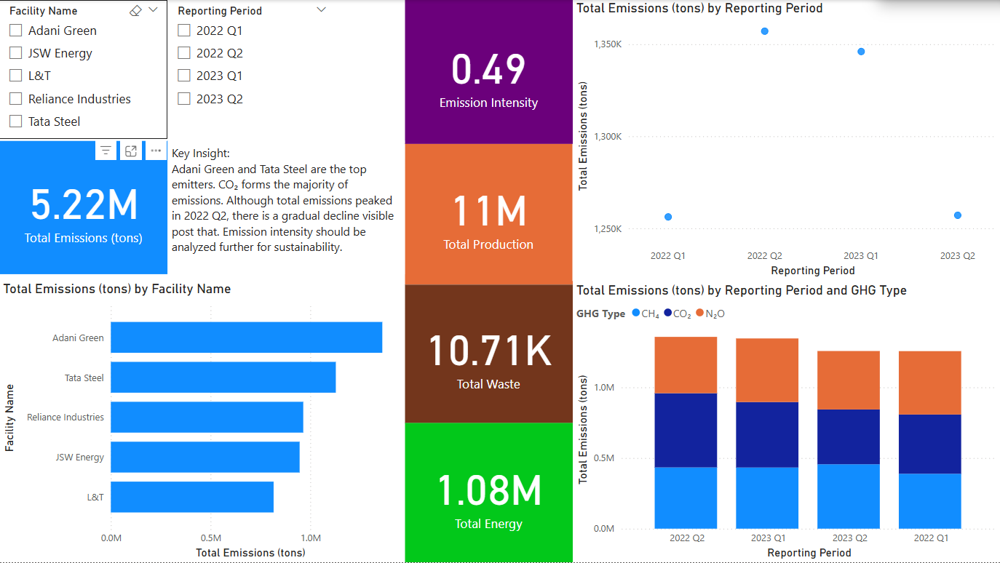

# 🌍 Sustainability & Carbon Impact Analysis

This project presents an independent analysis of sustainability and carbon emission data using Power BI. The goal is to assess environmental impact, identify high-emission areas, and explore actionable strategies to reduce carbon footprints.

## 📊 Power BI Dashboard

The `Sustainability_Dashboard.pbix` file contains an interactive dashboard that includes:

- Emission trends across sectors and time
- Key performance indicators (KPIs) for carbon impact
- Scenario-based simulations for policy and behavioral changes
- Sector-wise contribution to carbon output
- Visual insights into sustainability metrics

> ⚠️ You can view the dashboard by opening the `.pbix` file in [Power BI Desktop](https://powerbi.microsoft.com/desktop/).

### 🔍 Preview

Here’s a snapshot of the dashboard:

## 🧠 Objectives

- Identify major contributors to carbon emissions
- Evaluate the effectiveness of emission reduction strategies
- Communicate findings through interactive visualizations

## 📁 Files Included

| File                          | Description                                      |
|------------------------------|--------------------------------------------------|
| `Sustainability_Dashboard.pbix` | Power BI file with the complete dashboard       |
| `Impact_Assessment_Report.pdf`  | Supplementary report summarizing findings       |
| `Dashboard.jpg`                 | Static preview of the dashboard                 |

## 🛠 Tools Used

- Microsoft Power BI
- Excel / CSV data preprocessing
- Basic DAX expressions for calculated fields and measures

## ⚖️ License

This project is open for educational and research purposes. You are free to fork, use, or build upon it with proper credit.

## ✉️ Contact

For feedback or collaboration, feel free to reach out via GitHub or LinkedIn.

